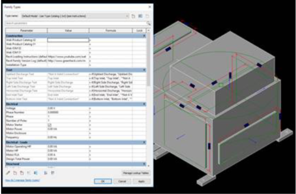
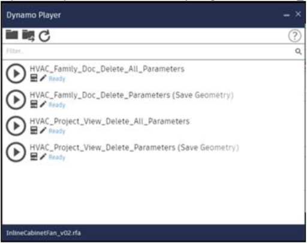
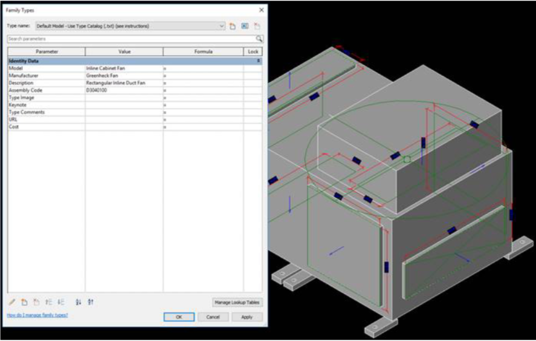

# Dynamo- Delete Parameters

By learning how to use Dynamo, the Revit API, and Python scripts, I was able to automate the deletion of unwanted parameters in a 3D Revit family. Manufacturers often provide Revit Families of their equipment with parameter names and types that do not match company standard. At that point the designer must manually delete these parameters one at at time, which can take a substantial amount of time depending on the size of the data set. My custom script deletes all parameters in a family, while also filtering out essential parameters (such as those that control the geometry of the model).

*Family of Mechanical Exhaust Fan with All Parameters*

 

*Dynamo Player Custom Buttons for Simple User Interface*

*Family with all but Built-In Parameters Removed*

